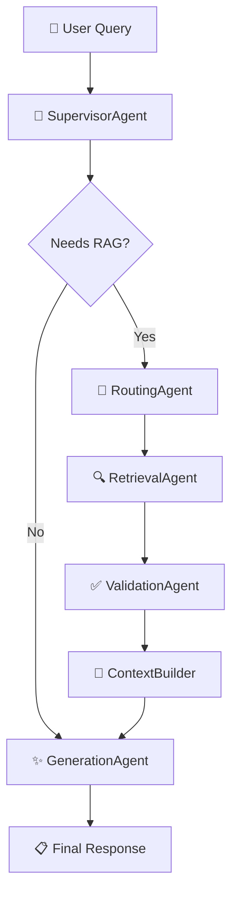

# LangGraph Implementation for Assistant Regulation

## 🎯 Vue d'Ensemble

Cette implémentation LangGraph remplace progressivement l'architecture orchestrateur existante avec une approche multi-agent moderne, tout en **réutilisant 100% de vos services métier existants**.

## 📁 Structure

```
assistant_regulation/planning/langgraph/
├── __init__.py                     # Exports principaux
├── orchestrator.py                 # 🎯 Orchestrateur principal LangGraph
├── compatibility_adapter.py        # Adaptateur de compatibilité
├── README.md                      # Cette documentation
├── 
├── state/                         # États partagés
│   ├── __init__.py
│   └── regulation_state.py        # TypedDict pour l'état workflow
├── 
├── agents/                        # Agents LangGraph
│   ├── __init__.py
│   ├── supervisor_agent.py        # 👑 Agent superviseur
│   ├── routing_agent.py           # 🧭 Agent de routage
│   ├── retrieval_agent.py         # 🔍 Agent de récupération
│   ├── validation_agent.py        # ✅ Agent de validation
│   └── generation_agent.py        # ✨ Agent de génération
└── 
└── workflows/                     # Définitions des graphes
    ├── __init__.py
    ├── regulation_workflow.py     # Workflow principal
    └── streaming_workflow.py      # Workflow streaming
```

## 🚀 Utilisation Rapide

### Remplacement Direct du ModularOrchestrator

```python
# Avant (ModularOrchestrator)
from assistant_regulation.planning.sync.modular_orchestrator import ModularOrchestrator

orchestrator = ModularOrchestrator(
    llm_provider="ollama",
    model_name="llama3.2",
    enable_verification=True
)

# Après (LangGraphOrchestrator)
from assistant_regulation.planning.langgraph import LangGraphOrchestrator

orchestrator = LangGraphOrchestrator(
    llm_provider="ollama",
    model_name="llama3.2",
    enable_verification=True,
    workflow_type="full"  # 🆕 Nouveau paramètre
)

# Interface identique !
result = orchestrator.process_query("Votre question réglementaire")
```

### Migration Progressive avec Adaptateur

```python
from assistant_regulation.planning.langgraph.compatibility_adapter import LangGraphCompatibilityAdapter

# Adaptateur avec fallback automatique
orchestrator = LangGraphCompatibilityAdapter(
    llm_provider="ollama",
    model_name="llama3.2",
    enable_verification=True,
    workflow_type="full",
    fallback_to_modular=True  # Utilise ModularOrchestrator si LangGraph échoue
)

# Interface 100% compatible
result = orchestrator.process_query("Votre question")
```

## 🏗️ Types de Workflows

### 1. Workflow Full (Recommandé)
```python
orchestrator = LangGraphOrchestrator(workflow_type="full")
```
- **Agents**: Supervisor → Routing → Retrieval → Validation → Generation
- **Usage**: Questions complexes nécessitant RAG complet
- **Performances**: Optimal pour qualité

### 2. Workflow Simple
```python
orchestrator = LangGraphOrchestrator(workflow_type="simple")
```
- **Agents**: Supervisor → Generation
- **Usage**: Questions simples sans RAG
- **Performances**: Très rapide

### 3. Workflow Streaming
```python
orchestrator = LangGraphOrchestrator(workflow_type="streaming")
```
- **Agents**: Optimisés pour réponse temps réel
- **Usage**: Interface utilisateur interactive
- **Performances**: Latence minimale

### 4. Workflow Debug
```python
orchestrator = LangGraphOrchestrator(workflow_type="debug", enable_debug=True)
```
- **Agents**: Tous avec traces détaillées
- **Usage**: Développement et debugging
- **Performances**: Verbose mais informatif

## 🔄 Agents et Services

### Mapping Services → Agents

| Service Existant | Agent LangGraph | Rôle |
|------------------|----------------|------|
| `MasterRoutingService` | `SupervisorAgent` | Coordination générale |
| `IntelligentRoutingService` | `RoutingAgent` | Routage intelligent |
| `RetrievalService` | `RetrievalAgent` | Recherche multimodale |
| `ValidationService` | `ValidationAgent` | Validation chunks |
| `GenerationService` | `GenerationAgent` | Génération réponse |
| `MemoryService` | `GenerationAgent` | Mémoire conversationnelle |

### Architecture du Workflow



## 💡 Fonctionnalités Avancées

### 1. Streaming Temps Réel

```python
# Streaming avec LangGraph
for event in orchestrator.process_query_stream("Votre question"):
    print(f"[{event['type']}] {event.get('message', '')}")
```

### 2. Changement Dynamique de Workflow

```python
# Changer de workflow à la volée
orchestrator.switch_workflow("streaming")  # Pour interface temps réel
orchestrator.switch_workflow("simple")     # Pour questions rapides
orchestrator.switch_workflow("debug")      # Pour debugging
```

### 3. Statistiques et Observabilité

```python
# Statistiques détaillées
stats = orchestrator.get_agent_statistics()
print(f"Workflow actif: {stats['workflow_type']}")
print(f"Agents initialisés: {stats['agents_initialized']}")
print(f"Temps moyen: {stats['processing_stats']['total_processing_time']}")
```

### 4. Comparaison Performance

```python
# Comparer LangGraph vs ModularOrchestrator
adapter = LangGraphCompatibilityAdapter(fallback_to_modular=True)
comparison = adapter.run_comparison_test("Votre question test")
print(comparison)
```

## 📊 Avantages vs Architecture Actuelle

| Aspect | ModularOrchestrator | LangGraphOrchestrator |
|--------|-------------------|---------------------|
| **Complexité Code** | 230+ lignes | 150 lignes core |
| **Orchestration** | Manuelle | Graphique native |
| **Observabilité** | Logs basiques | Traces complètes |
| **Extensibilité** | Difficile | Très facile |
| **Debugging** | Complex | Visuel + traces |
| **Streaming** | Basique | Optimisé |
| **Parallélisation** | Limitée | Native |
| **Maintenance** | Élevée | Faible |

## 🛠️ Installation et Prérequis

### Dépendances Supplémentaires

```bash
pip install langgraph langchain langchain-openai
```

### Configuration Minimale

```python
# Vos services existants continuent de fonctionner !
# Aucune modification requise dans :
# - RetrievalService
# - GenerationService  
# - ValidationService
# - MemoryService
# - Tous les services de routage
```

## 🔧 Migration Étape par Étape

### Étape 1: Installation
```bash
pip install langgraph langchain
```

### Étape 2: Test avec Adaptateur
```python
from assistant_regulation.planning.langgraph.compatibility_adapter import LangGraphCompatibilityAdapter

# Test avec fallback automatique
orchestrator = LangGraphCompatibilityAdapter(fallback_to_modular=True)
result = orchestrator.process_query("Test")
```

### Étape 3: Migration Progressive
```python
# Remplacer progressivement les imports
# from assistant_regulation.planning.sync.modular_orchestrator import ModularOrchestrator
from assistant_regulation.planning.langgraph import LangGraphOrchestrator as ModularOrchestrator

# Code client inchangé !
```

### Étape 4: Optimisation
```python
# Utiliser les nouvelles fonctionnalités
orchestrator.switch_workflow("streaming")
stats = orchestrator.get_agent_statistics()
```

## 🐛 Debugging et Développement

### Mode Debug Complet

```python
orchestrator = LangGraphOrchestrator(
    workflow_type="debug",
    enable_debug=True
)

result = orchestrator.process_query("Test debug")
# Affiche automatiquement:
# === SUPERVISOR START ===
# Current state keys: ['query', 'conversation_context', ...]
# === SUPERVISOR END ===
# === ROUTING START ===
# ...
```

### Traces d'Exécution

```python
result = orchestrator.process_query("Test")
trace = result['metadata']['agent_trace']
print(f"Agents exécutés: {trace}")
# ['supervisor_start', 'supervisor_complete', 'routing_start', ...]
```

## 📈 Performances et Monitoring

### Métriques Automatiques

```python
stats = orchestrator.get_conversation_stats()
print(f"Requêtes traitées: {stats['queries_processed']}")
print(f"Temps moyen: {stats['total_processing_time'] / stats['queries_processed']:.2f}s")
print(f"Taux d'erreur: {stats['errors'] / stats['queries_processed']:.2%}")
```

### Intégration LangSmith (Optionnel)

```python
# Configuration pour observabilité avancée
os.environ["LANGCHAIN_TRACING_V2"] = "true"
os.environ["LANGCHAIN_API_KEY"] = "your-key"

# Traces automatiques dans LangSmith !
```

## 🎯 Exemple Complet

```python
from assistant_regulation.planning.langgraph import LangGraphOrchestrator

# Initialisation
orchestrator = LangGraphOrchestrator(
    llm_provider="ollama",
    model_name="llama3.2",
    enable_verification=True,
    workflow_type="full"
)

# Utilisation classique
result = orchestrator.process_query(
    "Quels sont les critères de sécurité pour les systèmes de freinage ?",
    use_images=True,
    use_tables=True,
    top_k=5
)

print(f"Réponse: {result['answer']}")
print(f"Sources: {len(result['sources'])}")
print(f"Temps: {result['metadata']['processing_time']:.2f}s")

# Streaming
for event in orchestrator.process_query_stream("Question streaming"):
    if event['type'] == 'generation_chunk':
        print(event['content'], end='', flush=True)

# Statistiques
stats = orchestrator.get_agent_statistics()
print(f"Workflow: {stats['workflow_type']}")
```

## 🤝 Compatibilité

- ✅ **100% compatible** avec interface ModularOrchestrator
- ✅ **0% de refactoring** requis dans vos services
- ✅ **Migration progressive** sans interruption
- ✅ **Fallback automatique** en cas de problème
- ✅ **Même format** de réponses et métadonnées

---

## 🎉 Prêt à Migrer ?

1. **Testez** avec `LangGraphCompatibilityAdapter`
2. **Comparez** les performances avec `run_comparison_test()`
3. **Migrez** progressivement avec `switch_workflow()`
4. **Optimisez** avec les nouvelles fonctionnalités LangGraph

**Votre code métier reste inchangé - seule l'orchestration devient plus puissante !** 🚀